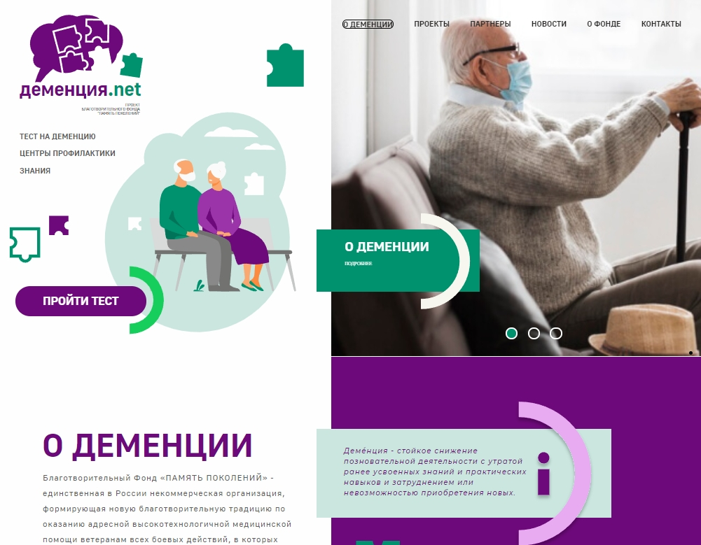

# Деменция.net

----
## О проекте
Реальный проект в [Яндекс.Практикуме](https://praktikum.yandex.ru).

Проект направлен на повышение осведомленности населения о проблемах когнитивного здоровья, своевременную диагностику деменции и когнитивных расстройств, ориентацию на непрерывную помощь и услуги высокого качества для больных с деменцией. 

Реализация сайта:
1. Адаптивная верстка главной страницы сайта с применением инструментов Grid Layout и Flexbox;
2. Статическая верстка двух страниц сайта: "Новости" и "Статья";
3. Анимация фона и элементов сайта;
4. Слайдеры для изображений

## Демо

[Ссылка на проект Деменция.net](https://janemikh.github.io/generational-memory-project/)

